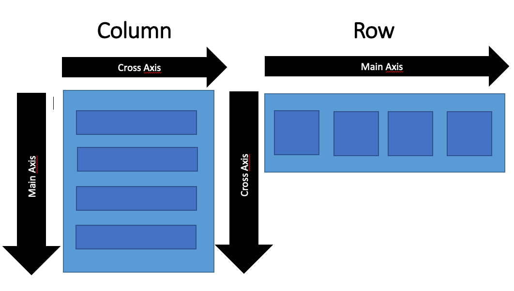

# flutter_ecommerce


## Assignement 9


### Why Create a Model for JSON Data?

Models help structure and manage JSON data efficiently. They allow automatic conversion between JSON and Dart objects, ensuring type safety and reducing errors during runtime. Without a model, handling data becomes error-prone, as improper data parsing can lead to crashes.

### Function of the `http` Library

The `http` library facilitates HTTP requests (GET, POST, etc.), enabling communication between the Flutter app and a backend server. It simplifies tasks like sending data to the server or retrieving responses.

### Purpose of `CookieRequest`

`CookieRequest` handles session-based authentication by managing cookies between client and server. Sharing a single `CookieRequest` instance ensures consistent session data across the app, avoiding the need to re-authenticate for every component.

### Data Transmission Mechanism in Flutter

1. **Input**: User enters data into a form.
2. **Transmission**: Data is sent to the backend via HTTP requests.
3. **Processing**: Backend processes the data and returns a response.
4. **Display**: Flutter parses the response and updates the UI.

### Authentication Mechanism

1. **Login/Register**:
   - User inputs credentials in Flutter.
   - Credentials are sent via `http`/`CookieRequest` to Django.
   - Django verifies credentials, creates a session, and returns a response.
2. **Logout**:
   - Flutter sends a logout request to Django.
   - Django clears the session and confirms the logout.
3. **UI Update**:
   - Based on authentication status, Flutter displays the appropriate menu or redirects to the login page.

## Implementation assignement 9

Fisrt I created the new app on the django back end and changed the settings and the routing.After the end point on django are finished I creted the form and necessary file to display the list to logout login and add a product

## Assignement 8

### 1.What is the purpose of const in Flutter? Explain the advantages of using const in Flutter code. When should we use const, and when should it not be used?

The `const` keyword in Flutter is used to define immutable widgets, ensuring that they don’t change after they're created. By marking a widget as `const`, we optimize our app's performance by reducing rebuilds and memory usage.

So it's adavantagouse to use const as a way to increase performance, `const` widgets are only created once and can be reused, reducing the work Flutter has to do and unnecessary widget buildings.

#### When to Use `const`:

- we should use `const` when a widget and its children do not depend on dynamic values or external state changes.

#### When Not to Use `const`:

- We should using `const` if the widget’s state or content will change during the lifecycle of the app.


### 2.Explain and compare the usage of Column and Row in Flutter. Provide example implementations of each layout widget!

The `Column` and `Row` are layout widgets used to align multiple widgets vertically and horizontally, respectively.

#### Example

- `Column` widget (arrange its children vertically, from top to bottom )

```dart

Column(
  children: [
    Text("Item 1"),
    Text("Item 2"),
    Text("Item 3"),
  ],
)
```

- `Row` widget (arranges its children horizontally, from left to right.)

```dart
Row(
  children: [
    Icon(Icons.star),
    Text("Starred"),
  ],
)
```

#### Illustration



### 3.List the input elements you used on the form page in this assignment. Are there other Flutter input elements you didn’t use in this assignment? Explain

In the assignment, I used `TextFormField` to enter the name, amount, and description. Each TextFormField includes validation logic to ensure proper data input.

-> Other Flutter Input Elements that I didn't used:

- `DropdownButton`: For selecting options from a dropdown list.
- `Switch`: For binary toggle input (on/off).
- `Slider`: For selecting a value along a continuous range.
    Checkbox: For toggling a true/false condition.

I didn't use these elements because the `TextFormField` was enough for what it's requested. I fmaybe we have to choose among a list or a 2 choices option we can use the `Slider` or the `Switch` widget.

### 4. How do you set the theme within a Flutter application to ensure consistency? Did you implement a theme in your application?

In Flutter, themes can be set at the root of the app using the ThemeData widget within the MaterialApp configuration. Yes, a theme was implemented in this application, to set the primary color for the app’s AppBar and button styles.

### 5.How do you manage navigation in a multi-page Flutter application?

In a multi-page Flutter application, navigation is typically managed using Flutter’s Navigator widget, which provides stack-based routing to navigate between screens.

## Assignment 7

### 1. Explain what are stateless widgets and stateful widgets, and explain the difference between them

In Flutter, widgets are the building blocks of the user interface, and they fall into two main types:

- **Stateless Widgets**: These are immutable widgets, meaning that their state cannot change once created. Stateless widgets are ideal for static content or when the UI does not need to react to user interactions or dynamic changes. Examples include Text, Icon, and Image.

- **Stateful Widgets**: These widgets maintain a mutable state that can change during the widget's lifecycle. Stateful widgets are used when the UI must update dynamically based on user input or other variables. Examples include Checkbox, TextField, and any widget that involves interactivity or animations.

**Difference**: The key difference lies in whether the widget can hold and change its state:

- **Stateless widgets**: No state change, static rendering.

- **Stateful widgets**: Maintains internal state, re-renders upon state changes.

## 2. Mention the widgets that you have used for this project and its uses

Here are some of the widgets used in this project and their purposes:

- **Container**: Used to create rectangular visual elements with customizable properties like padding, margin, and color.
- **Text**: Displays static text in the interface.
- **TextField**: Collects user input in the form of text.
- **ElevatedButton**: Renders a button that the user can tap to trigger actions.
- **ListView**: Enables vertical or horizontal scrolling of child widgets, often used to display lists of data.
- **Icon**: Displays an icon to enhance the UI.
- **Scaffold**: Provides a basic structure, including an AppBar and body, for organizing the app layout.

Each of these widgets contributes to the app’s interface and functionality, helping structure and present the content interactively.

## 3. What is the use-case for setState()? Explain the variable that can be affected by setState()

setState() is a method used in stateful widgets to update the UI in response to state changes. When setState() is called, Flutter marks the widget tree as dirty, triggering a rebuild. This method is commonly used in cases like user interactions, animations, or any situation where the UI needs to react to changes in the state.

Example variable that could be affected by setState():

- **Counter variable** in a counter app, where each button press increments the counter and updates the displayed number.
- **Boolean variables** controlling visibility or toggling states, like showing or hiding a widget when a button is pressed.

## 4. Explain the difference between const and final keyword.

- **const**: Declares compile-time constants. The value of a const variable must be assigned during compilation and cannot change at runtime. Constants declared with const are deeply immutable.

- **final**: Declares a runtime constant. The value is assigned only once and cannot be reassigned, but it can be determined at runtime. final variables are used for values that might depend on runtime input but should stay constant afterward.
